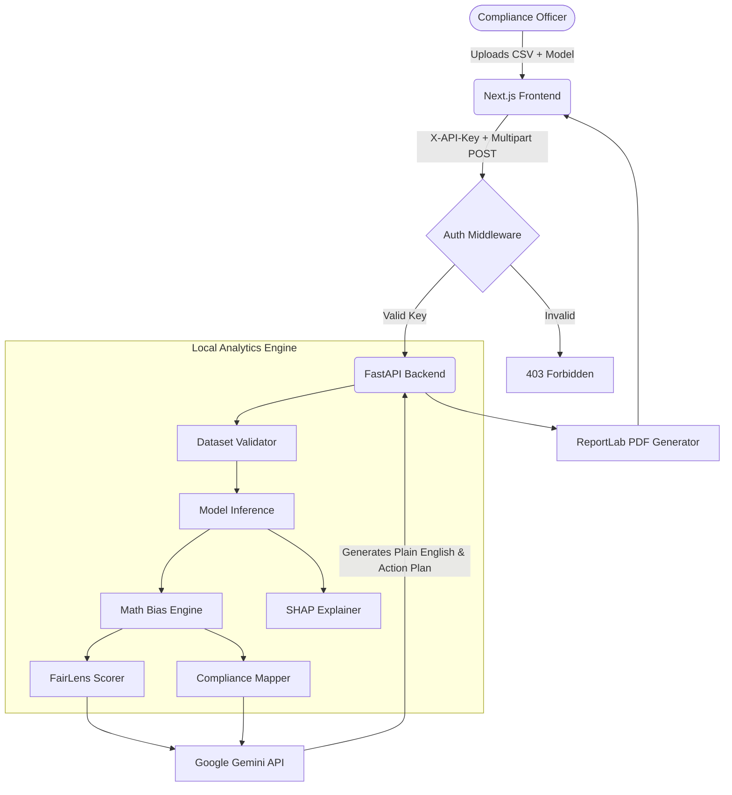

# FairLens

FairLens is an auditing platform for machine learning models. It provides a compliance layer designed to detect bias, measure severity, and generate remediation plans to ensure models meet regulatory and ethical standards before production deployment.

---

## Key Features

- **Bias Auditing**: Upload datasets and models to calculate Disparate Impact, Demographic Parity, Equalized Odds, and Calibration Difference.
- **FairLens Score**: A unified 0–100 scoring system summarizing the ethical posture of the model.
- **Regulatory Compliance Mapping**: Automatically maps failed metrics to legal frameworks including the EU AI Act, US EEOC 80% Rule, and ECOA.
- **Individual Prediction Explainer**: Analyzes single rows of data to explain predictions using SHAP waterfalls and automated counterfactual testing.
- **Side-by-Side Model Comparison**: Compares baseline models against remediated models to quantify fairness improvements.
- **AI Analysis**: Integrates with Google Gemini to provide plain-English insights into bias causes and remediation steps.
- **Audit History**: Persistent dashboard view to browse, filter, and compare previous audits.
- **PDF Audit Reports**: Exportable compliance-grade PDF reports with metrics, charts, compliance tables, and AI summaries.
- **PII Detection Warning**: Scans uploaded CSV columns for personal data and displays warnings prior to analysis.
- **Confidential PDF Watermark**: Audit reports are stamped with a diagonal CONFIDENTIAL watermark.
- **Secure Audit Log**: Actions on audit jobs are logged in a tamper-evident chain-of-custody panel.
- **API Security**: Endpoints are protected with X-API-Key authentication and IP-based rate limiting.

---

## Architecture



---

## Local Setup Instructions

### 1. Start the Backend (FastAPI)

```bash
cd backend

# Create and activate virtual environment
python -m venv venv
# Windows:
venv\Scripts\activate
# Mac/Linux:
source venv/bin/activate

# Install dependencies
pip install -r requirements.txt
pip install -r requirements-dev.txt

# Configure environment
copy .env.example .env                # Windows
# Edit .env — set SECRET_API_KEY and GEMINI_API_KEY at minimum

# Start the API
uvicorn main:app --reload --port 8000
```

The API will be available at `http://localhost:8000`. Interactive documentation is located at `http://localhost:8000/docs`.

### 2. Start the Frontend (Next.js)

Open a new terminal session:

```bash
cd frontend
npm install

# Configure environment
copy .env.local.example .env.local    # Windows
# Edit .env.local — set NEXT_PUBLIC_API_KEY to match backend SECRET_API_KEY

npm run dev
```

The dashboard will be available at `http://localhost:3000`.

---

## Production Deployment

FairLens is deployed as two services: **Backend on Render** and **Frontend on Vercel**.

### 1. Deploy the Backend (Render)

1. Go to [dashboard.render.com](https://dashboard.render.com) → **New Web Service**
2. Connect your GitHub repo (`Siri-shh/FairLens-Bias-Detection`)
3. Configure:
   - **Root Directory**: `backend`
   - **Runtime**: Docker
   - **Plan**: Free
4. Set environment variables in the Render dashboard:

| Variable | Value |
|---|---|
| `SECRET_API_KEY` | Generate with: `python -c "import secrets; print(secrets.token_hex(32))"` |
| `GEMINI_API_KEY` | Your Google AI Studio key |
| `USE_LOCAL_STORAGE` | `true` |
| `FRONTEND_URL` | `*` (update to your Vercel URL after deploying frontend) |
| `USE_MOCK_PIPELINE` | `false` |

5. Deploy. Note the URL (e.g. `https://fairlens-api-se7y.onrender.com`)

### 2. Deploy the Frontend (Vercel)

1. Go to [vercel.com](https://vercel.com) → **Add New Project**
2. Import your GitHub repo (`Siri-shh/FairLens-Bias-Detection`)
3. Configure:
   - **Root Directory**: `frontend`
   - **Framework**: Next.js (auto-detected)
4. Set environment variables in the Vercel dashboard:

| Variable | Value |
|---|---|
| `NEXT_PUBLIC_API_URL` | `https://fairlens-api-se7y.onrender.com/api/v1` *(your Render backend URL)* |
| `NEXT_PUBLIC_API_KEY` | Must match `SECRET_API_KEY` from step 1 |
| `NEXT_PUBLIC_USE_MOCK` | `false` |

5. Deploy.

> **Note:** The Render free tier spins down after 15 minutes of inactivity. The first request after idle may take 30–60 seconds to cold-start.

---

## Environment Variables

### Backend (`backend/.env`)

| Variable | Required | Description |
|---|---|---|
| `SECRET_API_KEY` | Yes | Shared secret for API authentication. Generate with: `python -c "import secrets; print(secrets.token_hex(32))"` |
| `GEMINI_API_KEY` | Yes | Google AI Studio key ([get one here](https://aistudio.google.com/apikey)) |
| `USE_LOCAL_STORAGE` | Yes | `true` = local disk (default) |
| `FRONTEND_URL` | Yes | Frontend domain for CORS. Use `*` for development. |
| `USE_MOCK_PIPELINE` | No | `true` = skip ML inference, use mock data |
| `LOCAL_UPLOAD_DIR` | No | Default: `./storage_local/uploads` |
| `LOCAL_RESULTS_DIR` | No | Default: `./storage_local/results` |

### Frontend (`frontend/.env.local`)

| Variable | Description |
|---|---|
| `NEXT_PUBLIC_API_URL` | Backend base URL. Default: `http://localhost:8000/api/v1` |
| `NEXT_PUBLIC_API_KEY` | Must exactly match `SECRET_API_KEY` in backend |
| `NEXT_PUBLIC_USE_MOCK` | `true` = bypass API and use built-in mock data |

---

## API Reference

All endpoints below require the `X-API-Key` header. The `/health` and `/` endpoints are public.

| Method | Endpoint | Description |
|---|---|---|
| `POST` | `/api/v1/upload/csv` | Upload a CSV dataset. Returns `job_id`, columns, row count. |
| `POST` | `/api/v1/upload/model` | Upload a `.pkl` or `.onnx` model file for the job. |
| `POST` | `/api/v1/analyze/configure` | Configure protected attributes and trigger the bias pipeline. |
| `GET` | `/api/v1/status/{job_id}` | Poll pipeline progress. |
| `GET` | `/api/v1/results/{job_id}` | Retrieve full results JSON. |
| `POST` | `/api/v1/explain` | Stream Gemini AI explanation as SSE. |
| `POST` | `/api/v1/ask` | Ask a follow-up question about the audit. |
| `POST` | `/api/v1/explain/individual` | Explain a single prediction row. |
| `POST` | `/api/v1/remediate/reweigh` | Apply reweighing and return updated metrics. |
| `GET` | `/api/v1/remediate/threshold` | Compute metrics at a given classification threshold. |
| `GET` | `/api/v1/report/{job_id}` | Generate PDF and return its download URL. |
| `GET` | `/api/v1/report/{job_id}/pdf` | Stream the PDF bytes directly. |
| `GET` | `/api/v1/history` | List all completed audits. |
| `GET` | `/health` | Health check endpoint. |

---

## Security

### API Key Authentication
Every analysis endpoint requires an `X-API-Key` header. The check uses `hmac.compare_digest()` to prevent timing attacks. Configure via the `SECRET_API_KEY` environment variable.

### Rate Limiting
IP-based rate limiting is implemented via `slowapi` (default: 200 requests/minute per IP).

### PII Detection
CSV uploads are scanned for 13 categories of personal data using keyword matching and regex patterns. Detection is best-effort and provides a warning without blocking the upload.

### Confidential PDF Watermark
Generated PDF audit reports are stamped with a diagonal CONFIDENTIAL watermark on every page (18% opacity).

### Secure Audit Log
Actions on an audit job are recorded in a per-job `audit.log` file (JSON-lines) providing a chain-of-custody log. Events tracked include uploads, explanation generation, Q&A queries, and report access.

### File Upload Guards
Files are validated before processing:
- CSV: extension check, max 200 MB, max 500 columns, max 2M rows, max 40% missing data
- Model: `.pkl`/`.onnx` only, max 500 MB

### CORS Policy
Origins are restricted to the configured `FRONTEND_URL` environment variable.

---

## Testing

```bash
cd backend

# Unit tests
pytest tests/ -v

# E2E smoke tests
python test_api.py
```

Test coverage includes Disparate Impact edge cases, perfect fairness baseline, and Equalized Odds violation detection within `tests/test_bias_engine.py`.

---

## Demo Instructions

FairLens includes three pre-built scenarios for evaluation:

1. Navigate to the frontend URL
2. Locate the "Try a pre-trained scenario" section
3. Select COMPAS (Criminal Justice), German Credit, or HMDA (Mortgage Lending)
4. Review the pipeline execution
5. Explore the FairLens Score, Compare Models page, AI Q&A, and export functionality.

---

## Project Structure

```
FairLens/
├── backend/
│   ├── main.py                    # FastAPI application
│   ├── Dockerfile                 # Production Docker container
│   ├── requirements.txt           # Production dependencies
│   ├── requirements-dev.txt       # Development dependencies
│   ├── routers/                   # Endpoint definitions
│   ├── services/                  # Business logic and external integrations
│   ├── ml/                        # Bias engine and ML remediation
│   └── tests/                     # Unit testing suite
├── frontend/
│   ├── app/                       # Next.js application routing and pages
│   ├── components/                # Reusable UI components
│   └── lib/                       # API clients and shared types
├── render.yaml                    # Render deployment config (backend)
└── docs/
    └── CHANGELOG.md               # Change history
```
